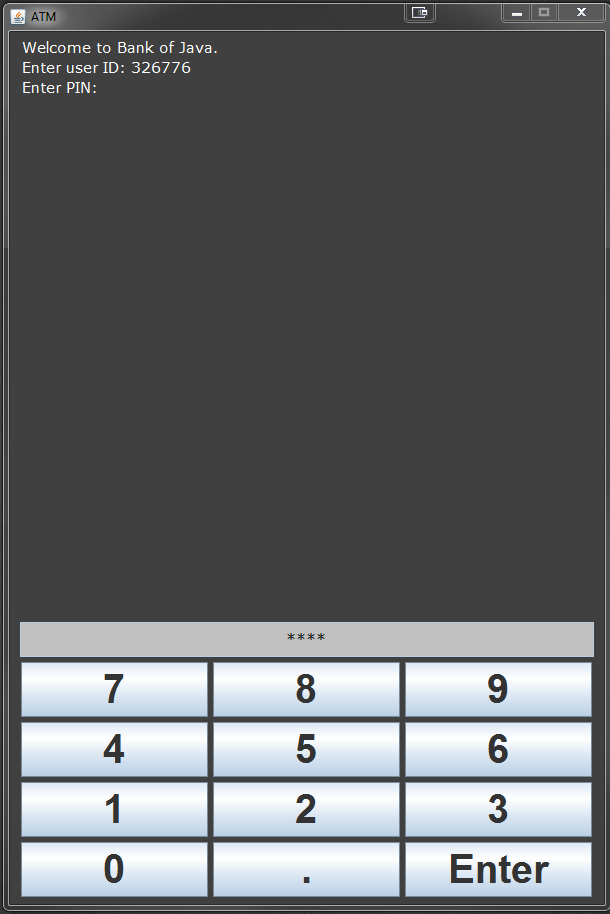
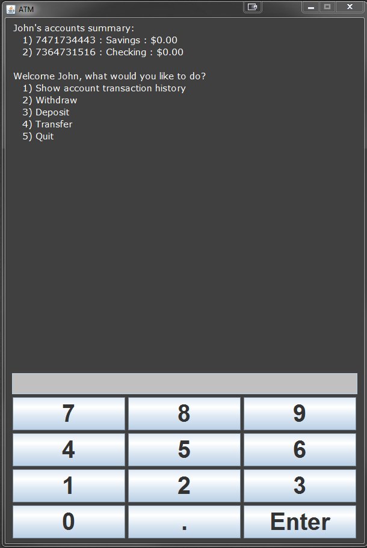
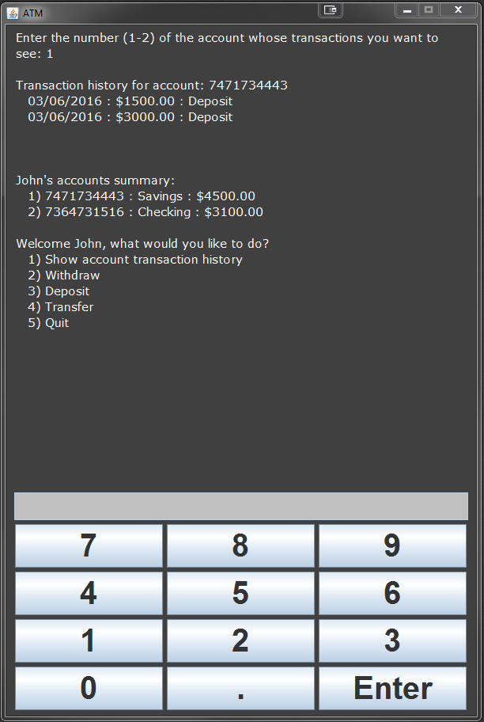
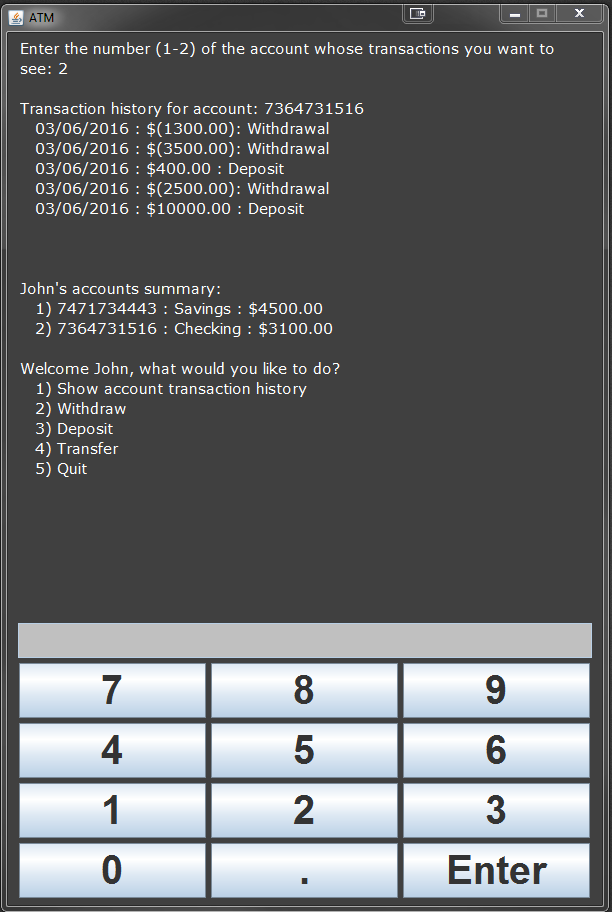

# ATM
The purpose of this program is to emulate the actions of an ATM interface. The GUI provides an easy to ready display and keypad. It also offers password protectection. After logging in with an authenticated ID and PIN, the user will be able to withdraw, deposit, and transfer money into an account. The ATM also displays the transaction history of an account much like online banking. 

---

#### Screenshots

  
  

   

  
  

